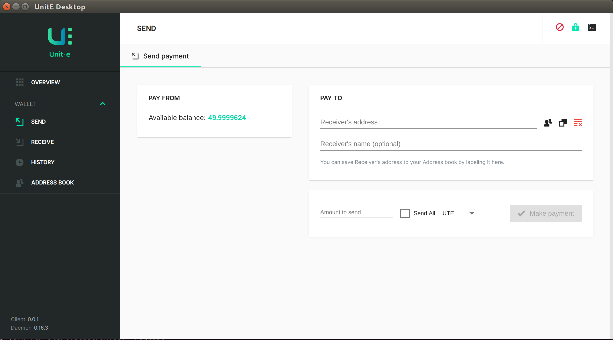

# unit-e-desktop – UI



> *"Unit-e is an open source project that aims to provide a lean way to make payments on the internet."*

This repository is the user interface that works in combination with the
[`unit-e`](https://github.com/drt-org/unit-e) client.

[Download the packaged wallet for Mac, Windows and Linux](https://github.com/dtr-org/unit-e-desktop/releases)

## Code of conduct

The Unit-e team is committed to fostering a welcoming and harassment-free
environment. All participants are expected to adhere to our [code of
conduct](CODE_OF_CONDUCT.md).

## Contribute

> Be sure to read our [Contributing Guidelines](CONTRIBUTING.md) first

## Development

### Boostrapping for development:

* Download + Install [Node.js®](https://nodejs.org/) 6.4+
* Download + Install [git](https://git-scm.com/)

#### MacOS packages gathering tips
```bash

# 0. install Xcode application from App Store.

# 1. switch developer directory to xcode one
$ sudo xcode-select --switch /Applications/Xcode.app/Contents/Developer/

# 2. install node and yarn
$ brew install node
$ brew install yarn
```

#### Clone and install dependecies

```bash
git clone https://github.com/dtr-org/unit-e-desktop
cd unit-e-desktop
yarn install
```

### Development with Electron

For development, we recommend using the `regtest` environment, which gives you
full control over the blockchain and allows running various test scenarios.

Assuming you have Unit-e Core installed on your machine, the steps to launch
the wallet GUI in development mode are:

1. Start the Unit-e daemon with `united -regtest`.
2. In a terminal, run `ng serve --env=regtest` to start the Angular dev server and keep it running
3. In another terminal, run `yarn run start:electron:dev --regtest` to
   start the Electron application.
   * Note: this command will auto-refresh the client on each saved change

You may then interact with the wallet GUI, as well as with the `united` daemon
directly, using the `unite-cli` program.

Alternatively, if you want the daemon process to be managed by the wallet GUI, you may skip
step 1 above, and change the `yarn` command in step 3 as follows:

    yarn run start:electron:dev --regtest --daemonpath=<path/to/united>

This will instruct the wallet GUI to launch a Unit-e daemon in the background.

## Command-line arguments

The command-line flags for the Electron application are:
   * `--v` – enable verbose logging to the terminal.
   * `--dev` – start the wallet GUI in developer mode. This automatically opens Chrome Developer Tools on client launch.
     Note that the developer mode requires that you start an Angular development server in another terminal (as shown above)
   * `--devport=XXX` – connect to the Angular development server on a port other than the default of 4200.
   * `--datadir=<dir>` – specify the directory to store the wallet and blockchain data
   * `--rpcport=<port>`, `--rpcuser=<user>`, `--rpcpassword=<password>`, `--rpcbind=<ip>` – set custom Unit-e JSON-RPC connection parameters
   * `--proxy=<ip:port>` – connect to the P2P network through SOCKS5 proxy
   * `--regtest` – use the testing environment and connect to a daemon launched in regtest mode.
   * `--testnet` – connect to a daemon using the testnet chain.
   * `--upnp` – use UPnP to map the listening port
   * `--daemonpath` – use a custom path for the Unit-e daemon started by the wallet GUI, e.g.
     `--daemonpath=/opt/unite/bin/united`

Omitting the `--regtest` flag forces the Electron client to connect to a testnet
Unit-e daemon by default.

### Running the unit tests

Run the unit tests with

```
ng test
```

This will open a browser window where the tests are running and show progress on
the command line. Keep the window open to continuously run the unit tests when
changing the code.

## Running

### Start Electron

* `yarn run start:electron:fast` – disables debug messages for faster startup (keep in mind using `:fast` disables auto-reload of app on code change)

### Package Electron

Building for Windows requires the 32-bit libraries to be available.
```
sudo apt-get install gcc-multilib
sudo apt-get install g++-multilib
```

* `yarn run package:win` – Windows
* `yarn run package:mac` – OSX
* `yarn run package:linux` – Linux

## Contributors

Join us in `#unite-core-dev` on FreeNode or on our developer [mailing list](https://lists.linuxfoundation.org/mailman/listinfo/unite-dev).

## Copyright

Copyright (C) 2018 Unit-e Maintainers.

Portions copyright (C) 2017-2018 Particl Maintainers.

The code in this repository is licensed under the [GPL](LICENSE).
